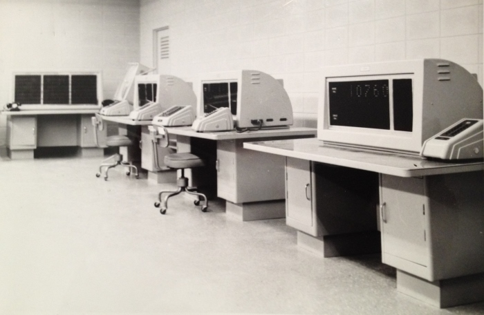
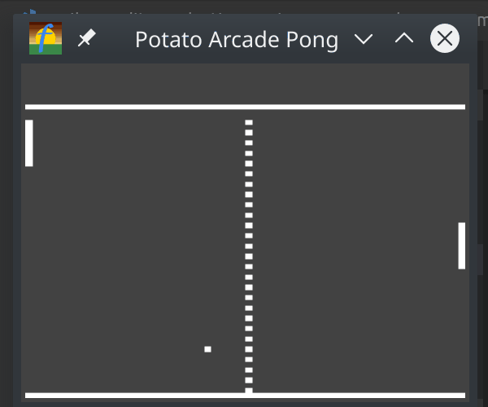
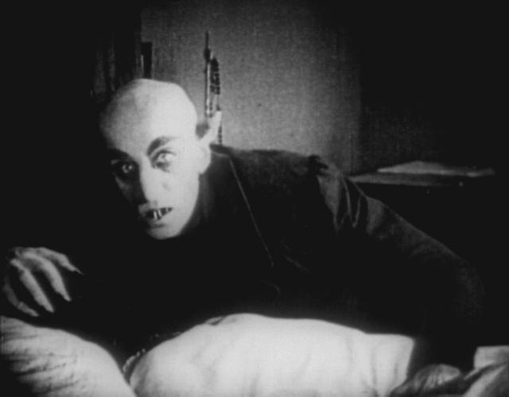

# Model P-64 Programmable Graphics Console

Introducing the Potato-64 emulator, written in 100% Go

(with a bit of OpenGL C code under the hood)




A fyne app  
http://fyne.io/fyne

## What is it, and why should I care ?



The P64 is a virtual piece of hardware, intended as a minimalist platform to write and execute nifty little graphics programs on.

The capablities of the machine are deliberately limited 

- like the resolution (64x64)
- the refresh rate (24Hz fixed)
- the onboard memory store (64 'banks' of memory to store variables in)
- and of course ... the colour palette of the display  (Monochrome).


But like shooting black and white film in the digital age, these extremely limited constraints really force you to open up your creative side. To use the machine to tell a story.


You can write complete, and compelling games in an lunch break ....  but only if you think creatively, and code around the limitations of the hardware.  Getting your code to work well needs to you to think about the code from the machine's point of view.


Its literally BASIC, so its easy to get started with and easy to learn. But deceptively hard to master. 


Like a photographer armed with an old film camera, you have the same challenge of creating something compelling that jumps off the page. Its about the image, not the equipment.


Can YOU think up an addictive game that fits within the limitations of the hardware ?


## Install it

```
go get -u github.com/potato-arcade/p64
```

## Usage

Run the Potato Console

```
potato64 filename
```

eg - `potato64 ~/go/src/github.com/potato-arcade/p64/ROM/BOUNCY.BAS` to get up and running


Run the Basic Interpreter to test some code
```
p64basic filename
```




## The Machine

The Potato console contains the following components :

- The CPU
- The ROM Cartridge Slot
- The Memory Banks
- Video Controller
- The IO controller
- The Audio Controller

Because we are not trying to emulate any known machine, the definition of the P64 itself is entirely software driven - so we can give it additional concepts, features, bugs and limitations that do not even exist in any real hardware.


### The CPU, model P64-101

The CPU is a single core machine that executes BASIC as its core instruction set, with some minor extensions.

On power up, the machine runs its startup BIOS diagnostics, loads the conntents of the ROM Cartridge into the memory banks, 
and then passes CPU control to run the code in Memory Bank 42

### The ROM Cartridge Slot, model RC64-110

The machine boots off a ROM Cartridge, which must be inserted into the machine before power on.

You do this when passing the filename of the ROM Cartridge to the `potato64` command on the command line.

ie - `potato64 ROM/TENNIS.BAS` will insert the Tennis Cartridge into the machine on boot.

This file must contain valid BASIC instructions.  Execution starts at the beginning of the file, and runs
sequentially until it hits the `END` statement.

So the first block of code in the ROM Cartridge, up to the first `END` statement is used to setup the game state, and write these into the memory banks for later use.


### The Memory Bank Controller, model MB-1492

The machine has 64 "Memory Banks", which are addressed by the numbers 1 - 64.

Each "Memory Bank" can be used to store 1 object, regardless of size. 

An Object can be :

- A String
- A Number
- An array of Numbers

How to use the memory banks in code - store a value to a memory bank.
```
10 LET X = 10
20 POKE 1, X
```

How to use the memory banks in code - retrieve a value from a memory bank.
```
10 X = PEEK 1
20 PRINT "The value of X is", X
```

Some of these Memory Banks are reserved for special purposes, but ALL of them are READ / WRITE !!

Reserved Memory Banks (TODO):

User Memory Banks
- 1 .. 32  User is free to use however they like.

Video Memory Banks
- 33 The Video Framebuffer, being an array of 4096 Numbers, arranged consequetively as 1st Row, 2nd Row ... 64th Row. 
- 34,35,36 - 2nd, 3rd, 4th Alternate Framebuffers 
- 37 Foreground Color, string RGBA
- 38 Background Color, string RGBA
- 39 Border Color, string RGBA
- 40 Video Control Register, a bitmask to control which of the framebuffers are displayed
- 41 Hue Modification Register 
- 46 Refresh Rate Register, number, can be used to select the framebuffer refresh rate
- 47 Image Effect Register, number, bitmask to select framebuffer post processing modes

Code Memory Banks
- 42 Boot Code. In this memory bank, you can find the complete BASIC code as loaded from the ROM Cartridge.
- 43 VSYNC Code for the interrupt handler.
- 44 KEYDOWN Code for the interrupt handler.
- 45 KEYUP Code for the interrupt handler.

... yes the code is user addressible, and user writable.  You could for example re-write the contents of the KEYDOWN handler inside some other code, if you really wanted to.

Audio Registers
- 48 The Audio Buffer, string,  being an array of Notes to be played in an endless loop.
- 49 Secondary Audio Buffer, string,  being an array of Notes to be played in an endless loop.
- 50 Audio Sample Buffer, string,  being an array of Notes to be played once.
- 51 Audio Control Register, number, a bitmask to control which audio channels are active.

- 52 .. 60  Not used

- 61 1st Sprite Register, string, contains x,y location, bitmap and bitmask, collision detection bit for sprite 1
- 62 2nd Sprite Register
- 63 3rd Sprite Register
- 64 4th Sprite Register

### Video Controller, model EnVideon-4K/24

The Video Controller is fixed frequency framebuffer device with a 4K capability.   (Thats 4K pixels in total)

This model of video controller executes a framebuffer read at a rate of 24Hz (every 41ms or so), at which point it draws the current framebuffer onto the video output as an array of 64x64 dots.

After that, it generates a VSYNC interrupt, which the CPU then picks up and uses to call the code to start building the next frame.M

```
Vertical Sync Interrupt (VSYNC)

This interrupt is generated when the video controller has completed one clean pass of outputting a frame to the video output.
```

Video Memory Banks of interest.  (TODO - Work in progress, not available yet)
- 33 The Video Framebuffer, being an array of 4096 Numbers, arranged consequetively as 1st Row, 2nd Row ... 64th Row. 
- 34,35,36 - 2nd, 3rd, 4th Alternate Framebuffers 
- 37 Foreground Color, string RGBA
- 38 Background Color, string RGBA
- 39 Border Color, string RGBA
- 40 Video Control Register, a bitmask to control which of the framebuffers are displayed
- 41 Hue Modification Register 
- 46 Refresh Rate Register, number, can be used to select the framebuffer refresh rate
- 47 Image Effect Register, number, bitmask to select framebuffer post processing modes

### The IO controller
### The Audio Controller

## ROM Cartridges

## Roll your own ROM


## TODO

- Overlay graphical image of the console, like Andy's Beeb emulator

- Bootup static to look like real static

- Extra Video Modes

- Text Mode

- Colors !!  Colored border

- Graphics primitives mapped to PotatoBASIC
    - LINE x,y,x2,y2,style
    - CIRCLE x,y,r
    - TEXT x,y,string
    - RECT x,y,x2,y2
    - FILLBOX x,y,x2,y2

- Sprites !

- Extra framebuffers, with BLIT commands to fast copy between them

- Memory bank access to framebuffer

- Memory bank access to the ROM code, so you can write self-modifying code

## If you like this, you should like these repos too

https://github.com/skx/gobasic

https://github.com/fyne-io/fyne

https://github.com/go-gl/glfw

https://gitlab.com/rastersoft/fbzx

https://github.com/remogatto/gospeccy

https://github.com/ichikaway/goNES/


## Further reading - some vids you might like, to get you in the mood for P64 coding

PONG - First documented Video Ping-Pong game - 1969

https://www.youtube.com/watch?v=XNRx5hc4gYc


c64 peeks and pokes

https://www.youtube.com/watch?v=k4BCyfpP38Q
https://www.youtube.com/watch?v=zAndQn1p5L8


Incredible story of how they recovered the Apollo mission control software from the dumpster

https://www.youtube.com/watch?v=WquhaobDqLU